```text
    _            __     __  _ _             __          __  _
   | |           \ \   / / | | |            \ \        / / | |
   | |__  _   _   \ \_/ /__| | | _____      _\ \  /\  / /__| |__
   | '_ \| | | |   \   / _ \ | |/ _ \ \ /\ / /\ \/  \/ / _ \ '_ \
   | |_) | |_| |    | |  __/ | | (_) \ V  V /  \  /\  /  __/ |_) |
   |_.__/ \__, |    |_|\___|_|_|\___/ \_/\_/    \/  \/ \___|_.__/
           __/ |
          |___/             https://yellowweb.top

If you like this script, PLEASE DONATE!
```

[Support this project](https://yellowweb.top/donate)

# YWB.Roulette.JS

[Русский](README.md) | [English](README.en.md)

A landing-page discount wheel with an initialization API similar to YWB Doors, GiftBoxes and 3from5. Version **1.0.0**. No jQuery or other dependencies.

[Live demo and documentation (Russian)](https://yellow-scripts.pages.dev/scripts/roulette/) | [Yellow Web](https://yellowweb.top/)

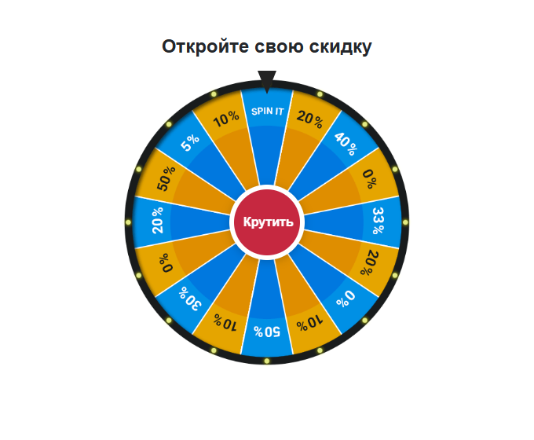

## Installation

Copy `ywbroulette.js`, `ywbroulette.css` and `prizewheel.png` to your website. The wheel container and order form must be separate elements; do not place the form inside the wheel container.

```html
<link rel="stylesheet" href="ywbroulette.css">

<div id="roulette"></div>
<form id="order" action="/order.php" method="post">
  <input name="name" autocomplete="name" required>
  <input name="phone" type="tel" autocomplete="tel" required>
  <button type="submit">Order</button>
</form>

<script src="ywbroulette.js"></script>
<script>
  const roulette = initRoulette({
    selectors: { roulette: '#roulette', form: '#order' },
    texts: {
      title: 'Reveal your discount',
      button: 'Spin',
      popupTitle: 'Your discount: 50%',
      popupText: 'Your discount is available in the order form.',
      confirm: 'Claim discount'
    },
    image: 'prizewheel.png',
    duration: 4500,
    stopAngle: 67.5,
    onResult: ({ angle }) => console.log('Result', angle),
    onComplete: () => console.log('Form revealed')
  });
</script>
```

Call `initRoulette` after both elements exist in the DOM. CSS, JavaScript and image paths in this example are relative to the HTML page. A server-side form handler is not included.

## Options and API

| Option | Default | Description |
| --- | --- | --- |
| `selectors.roulette` | Required | CSS selector or DOM element for the wheel container |
| `selectors.form` | Required | CSS selector or DOM element for the form or its wrapper |
| `texts` | Russian labels | Heading, spin button, result title and message, confirmation button |
| `image` | `prizewheel.png` | Wheel image |
| `duration` | `4500` | Animation duration in milliseconds, minimum 0 |
| `stopAngle` | `67.5` | Final angle in degrees after five full turns |
| `onResult` | Not set | Callback after the wheel stops and the result opens |
| `onComplete` | Not set | Callback after confirmation and revealing the form |

The returned instance exposes `spin()`, `destroy()` and a `state` property: `ready`, `spinning`, `result`, `complete`. Calling `initRoulette` again for the same container returns the existing instance. `destroy()` cancels the timer, removes the widget and restores the original container markup and form visibility. To start a new round, call `initRoulette` again after `destroy()`.

Repeated clicks while spinning are ignored. The button supports keyboard activation. Escape in the result dialog confirms the result and reveals the form. Focus moves to the first field. Animation is skipped when `prefers-reduced-motion` is enabled.

The `texts` option customizes the visible headings and buttons shown above. The image alt text and spinning status remain in Russian in version 1.0.0.

## Result and Artwork

The discount is predetermined, not random. With the included image, `67.5` places the 50% sector under the top pointer. If you replace the image or change the angle, match the result text to the displayed sector. Your server must validate the discount applied to an order.

The wheel artwork comes from the [original CPARIP roulette](https://cpa.rip/stati/roulette-script/). The JavaScript integration module was reworked for Yellow Scripts. Rights to the original artwork belong to its respective rights holders; no separate license for it is granted here.

## Additional Wheels

Four images from the [Yellow Web post dated August 29, 2022](https://t.me/yellow_web/830). Available as PNG images with transparent backgrounds. Rights remain with the original artwork owners; no separate license is granted here.

Copy the `wheels` directory to your website and replace `image` and `stopAngle` in your configuration. These angles place a **50%** sector under the top pointer:

| File | `stopAngle` | Source |
| --- | --- | --- |
| `wheels/telegram-830.png` | `315` | [Post 830](https://t.me/yellow_web/830?single) |
| `wheels/telegram-831.png` | `0` | [Post 831](https://t.me/yellow_web/831?single) |
| `wheels/telegram-832.png` | `180` | [Post 832](https://t.me/yellow_web/832?single) |
| `wheels/telegram-833.png` | `67.5` | [Post 833](https://t.me/yellow_web/833?single) |

```js
const roulette = initRoulette({
  selectors: { roulette: '#roulette', form: '#order' },
  image: 'wheels/telegram-830.png',
  stopAngle: 315
});
```

Screenshots of each image in the working widget (Russian labels):

| 830: multicolor, 8 sectors | 831: gradient, 8 sectors |
| --- | --- |
| 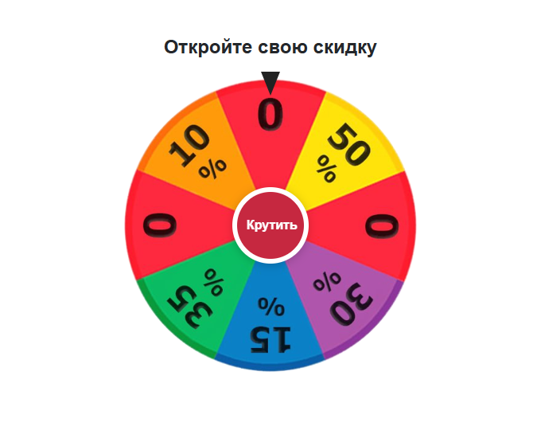 | 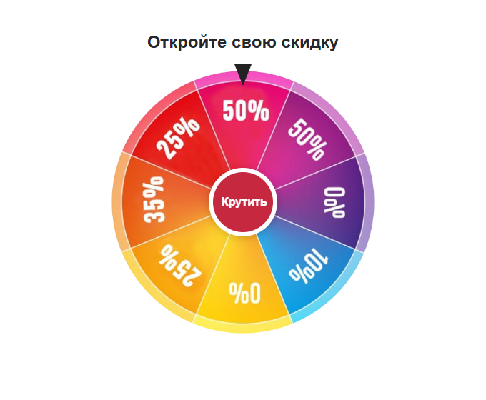 |

| 832: blue and yellow, 16 sectors | 833: red and yellow, 16 sectors |
| --- | --- |
| 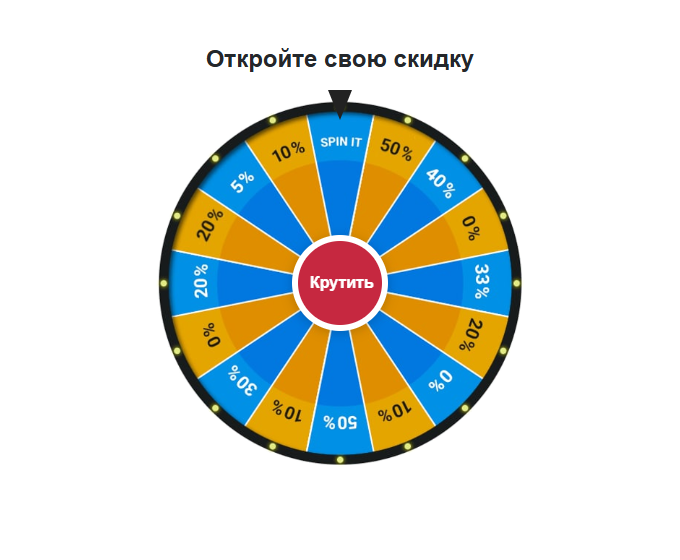 | 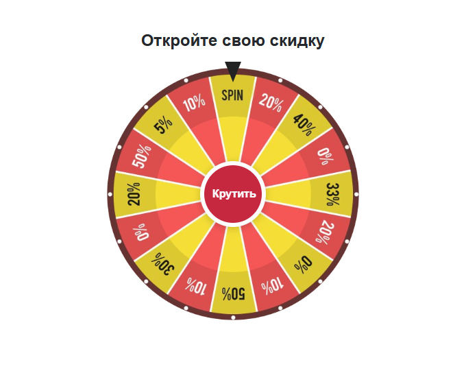 |

## Eight More Designs

All additional wheels are supplied as 512 × 512 PNG images with transparent backgrounds.

Use `image: 'wheels/filename.png'`. For `coral-turquoise.png`, `stopAngle: 90` places 50% under the pointer; for `green-discount.png`, use `stopAngle: 315`. For other designs, choose the angle and set `texts.popupTitle`, `texts.popupText` and `texts.confirm` to match your prizes. Do not keep the default 50% message for wheels showing amounts, FS or no labels: the script does not interpret the image or award prizes. Artwork rights remain with their respective owners.

| Turquoise and pink, with a gold center | Pastel, unlabeled |
| --- | --- |
| [coral-turquoise.png](wheels/coral-turquoise.png) | [pastel.png](wheels/pastel.png) |
| 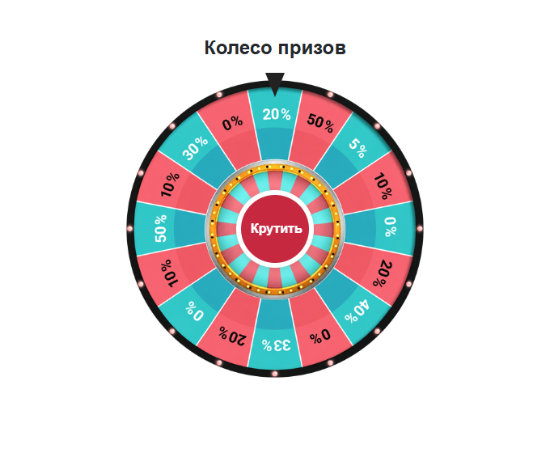 | 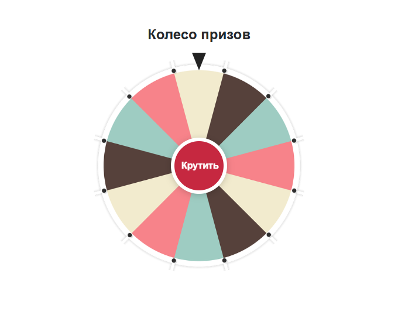 |

| Multicolor discounts | Multicolor with Jackpot |
| --- | --- |
| [discounts.png](wheels/discounts.png) | [jackpot.png](wheels/jackpot.png) |
| 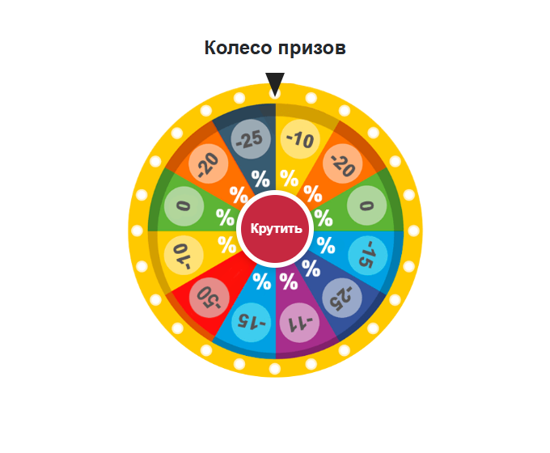 | 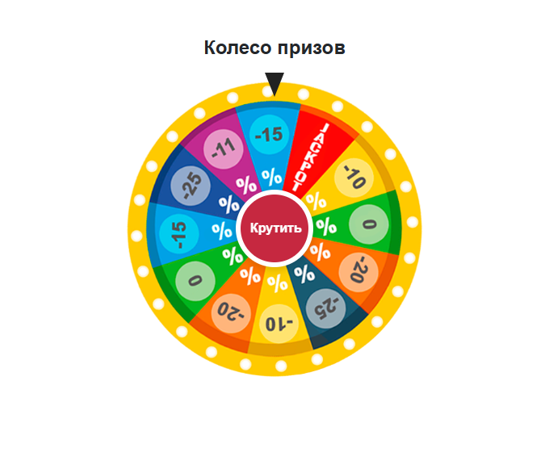 |

| Color wheel, unlabeled | Green discount wheel |
| --- | --- |
| [colors.png](wheels/colors.png) | [green-discount.png](wheels/green-discount.png) |
| 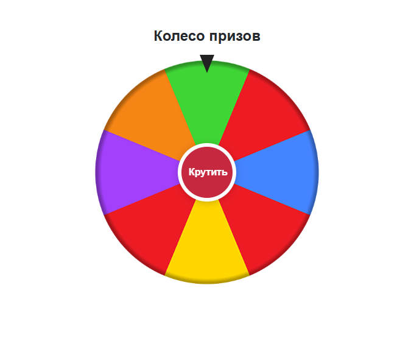 | 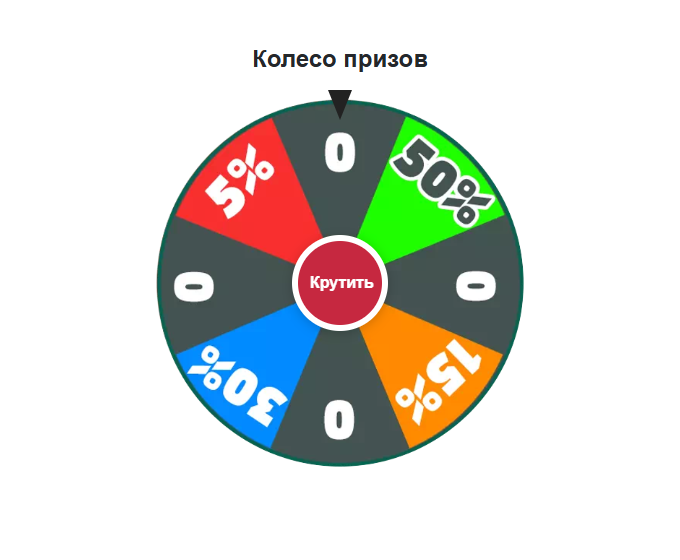 |

| Bonuses: amounts, FS, MISS | Gold: numbers, prizes and multipliers |
| --- | --- |
| [bonus-spinner.png](wheels/bonus-spinner.png) | [prize-gold.png](wheels/prize-gold.png) |
| 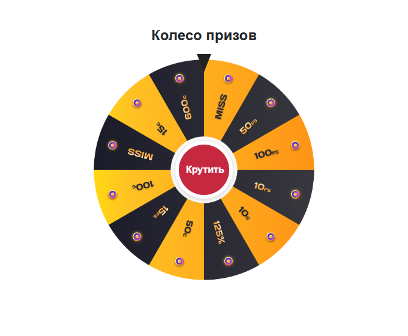 | 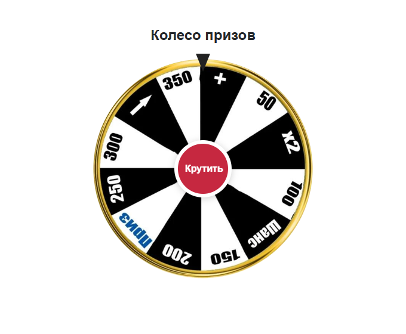 |

## Trying the Example

Open `index.html` in a browser. The included example disables form submission with an explicitly marked `submit` handler. Remove that handler and set your own form `action` when deploying to a live landing page.

The example has been tested at mobile and desktop widths, including wheel animation, repeated activation, result confirmation, keyboard controls, focus transfer, reinitialization and instance destruction.
