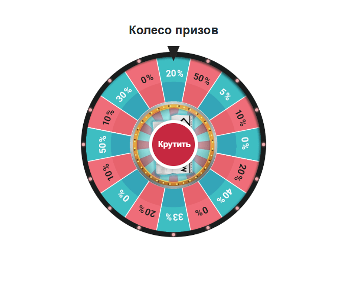

```text
    _            __     __  _ _             __          __  _
   | |           \ \   / / | | |            \ \        / / | |
   | |__  _   _   \ \_/ /__| | | _____      _\ \  /\  / /__| |__
   | '_ \| | | |   \   / _ \ | |/ _ \ \ /\ / /\ \/  \/ / _ \ '_ \
   | |_) | |_| |    | |  __/ | | (_) \ V  V /  \  /\  /  __/ |_) |
   |_.__/ \__, |    |_|\___|_|_|\___/ \_/\_/    \/  \/ \___|_.__/
           __/ |
          |___/             https://yellowweb.top

If you like this script, PLEASE DONATE!
```

[Поддержать проект](https://yellowweb.top/donate)

# YWB.Roulette.JS

[Русский](README.md) | [English](README.en.md)

Рулетка для лендинга с подключением в стиле YWB Doors, GiftBoxes и 3from5. Версия **1.0.0**. Без jQuery и других зависимостей.

[Живой пример и описание](https://yellow-scripts.pages.dev/scripts/roulette/) · [Жёлтый Веб](https://yellowweb.top/)


## Подключение

Скопируйте `ywbroulette.js`, `ywbroulette.css` и `prizewheel.png` на свой сайт. Контейнер рулетки и форма должны быть отдельными элементами; форма не должна находиться внутри контейнера рулетки.

```html
<link rel="stylesheet" href="ywbroulette.css">

<div id="roulette"></div>
<form id="order" action="/order.php" method="post">
  <input name="name" autocomplete="name" required>
  <input name="phone" type="tel" autocomplete="tel" required>
  <button type="submit">Заказать</button>
</form>

<script src="ywbroulette.js"></script>
<script>
  const roulette = initRoulette({
    selectors: { roulette: '#roulette', form: '#order' },
    texts: {
      title: 'Откройте свою скидку',
      button: 'Крутить',
      popupTitle: 'Ваша скидка — 50%',
      popupText: 'Скидка доступна в форме заказа.',
      confirm: 'Получить скидку'
    },
    image: 'prizewheel.png',
    duration: 4500,
    stopAngle: 67.5,
    onResult: ({ angle }) => console.log('Результат', angle),
    onComplete: () => console.log('Форма открыта')
  });
</script>
```

Вызывайте `initRoulette` после появления обоих элементов в DOM. Пути CSS, JS и картинки в примере относительны к HTML-странице. Серверный обработчик заявок в комплект не входит.

## Настройки и API

| Параметр | Значение по умолчанию | Назначение |
| --- | --- | --- |
| `selectors.roulette` | Обязателен | CSS-селектор или DOM-элемент контейнера игры |
| `selectors.form` | Обязателен | CSS-селектор или DOM-элемент формы/блока с формой |
| `texts` | Русские подписи | Заголовок, кнопка, текст результата и подтверждение |
| `image` | `prizewheel.png` | Изображение колеса |
| `duration` | `4500` | Длительность в миллисекундах, минимум 0 |
| `stopAngle` | `67.5` | Конечный угол в градусах после пяти оборотов |
| `onResult` | Не задан | Вызов после остановки и открытия результата |
| `onComplete` | Не задан | Вызов после подтверждения и открытия формы |

Экземпляр возвращает `spin()`, `destroy()` и свойство `state`: `ready`, `spinning`, `result`, `complete`. Повторный `initRoulette` для того же контейнера возвращает существующий экземпляр. `destroy()` отменяет таймер, убирает интерфейс и восстанавливает исходную разметку контейнера и видимость формы. Для нового розыгрыша после `destroy()` вызовите `initRoulette` заново.

Повторные клики во время вращения игнорируются. Кнопка работает с клавиатуры. Escape в окне результата подтверждает результат и открывает форму. Фокус переходит в первое поле. При `prefers-reduced-motion` вращение пропускается.

## Результат и графика

Это заданная скидка, а не случайная лотерея. У стандартного изображения угол `67.5` останавливает сектор 50% под верхним указателем. При замене изображения или угла согласуйте текст результата с нарисованным сектором. Размер скидки в заказе должен проверяться вашим сервером.

Графика колеса взята из [исходной рулетки CPARIP](https://cpa.rip/stati/roulette-script/). JS-модуль подключения переработан для Yellow Scripts. Права на исходную графику принадлежат её правообладателям; отдельная лицензия на неё здесь не предоставляется.

## Дополнительные колёса

Четыре изображения из [поста в «Жёлтом Вебе» от 29 августа 2022 года](https://t.me/yellow_web/830). Сохранены как JPEG из публичной веб-версии Telegram, без перерисовки. Права остаются у авторов изображений; отдельная лицензия на них не предоставляется.

Скопируйте папку `wheels` на сайт и замените `image` и `stopAngle` в настройках. Углы ниже выставляют сектор **50%** под верхним указателем:

| Файл | `stopAngle` | Источник |
| --- | --- | --- |
| `wheels/telegram-830.jpg` | `315` | [Пост 830](https://t.me/yellow_web/830?single) |
| `wheels/telegram-831.jpg` | `0` | [Пост 831](https://t.me/yellow_web/831?single) |
| `wheels/telegram-832.jpg` | `180` | [Пост 832](https://t.me/yellow_web/832?single) |
| `wheels/telegram-833.jpg` | `67.5` | [Пост 833](https://t.me/yellow_web/833?single) |

```js
const roulette = initRoulette({
  selectors: { roulette: '#roulette', form: '#order' },
  image: 'wheels/telegram-830.jpg',
  stopAngle: 315
});
```

Скриншоты работающего виджета с каждым изображением:

| 830: разноцветное, 8 секторов | 831: градиентное, 8 секторов |
| --- | --- |
|  |  |

| 832: сине-жёлтое, 16 секторов | 833: красно-жёлтое, 16 секторов |
| --- | --- |
|  |  |

## Ещё восемь вариантов

PNG предоставлены владельцем репозитория и сохранены без изменений. У первых семи файлов есть альфа-канал. У `prize-gold.png` шахматная подложка является частью изображения, прозрачности нет. У `bonus-spinner.png` широкие прозрачные поля, поэтому само колесо выглядит меньше. Центральная кнопка виджета перекрывает часть рисунка, в том числе товар на `maximizer.png`.

Подключение такое же: `image: 'wheels/имя-файла.png'`. Для `maximizer.png` сектор 50% находится под указателем при `stopAngle: 90`, для `green-discount.png` при `stopAngle: 315`. Для остальных вариантов подберите угол и задайте `texts.popupTitle`, `texts.popupText`, `texts.confirm` под свои призы. Не оставляйте стандартные 50% у колеса с денежными суммами, FS или без надписей: скрипт не распознаёт изображение и не начисляет призы. Права на графику остаются у её авторов.

| Бирюзово-розовое, с товаром MAXIMIZER в центре | Пастельное, без надписей |
| --- | --- |
| [maximizer.png](wheels/maximizer.png) | [pastel.png](wheels/pastel.png) |
|  |  |

| Разноцветное, со скидками | Разноцветное, с Jackpot |
| --- | --- |
| [discounts.png](wheels/discounts.png) | [jackpot.png](wheels/jackpot.png) |
|  |  |

| Цветное, без надписей | Зелёное, со скидками |
| --- | --- |
| [colors.png](wheels/colors.png) | [green-discount.png](wheels/green-discount.png) |
|  |  |

| Бонусное: суммы, FS, MISS | Золотое: числа, призы и множители |
| --- | --- |
| [bonus-spinner.png](wheels/bonus-spinner.png) | [prize-gold.png](wheels/prize-gold.png) |
|  |  |

## Проверка примера

Откройте `index.html` в браузере. В комплектном примере отправка формы отключена явно указанным обработчиком `submit`. Удалите его при установке на рабочий лендинг и укажите свой `action`.

Проверены мобильная и десктопная ширина, движение колеса, повторный запуск, подтверждение результата, управление клавиатурой, переход фокуса, повторная инициализация и уничтожение экземпляра.
